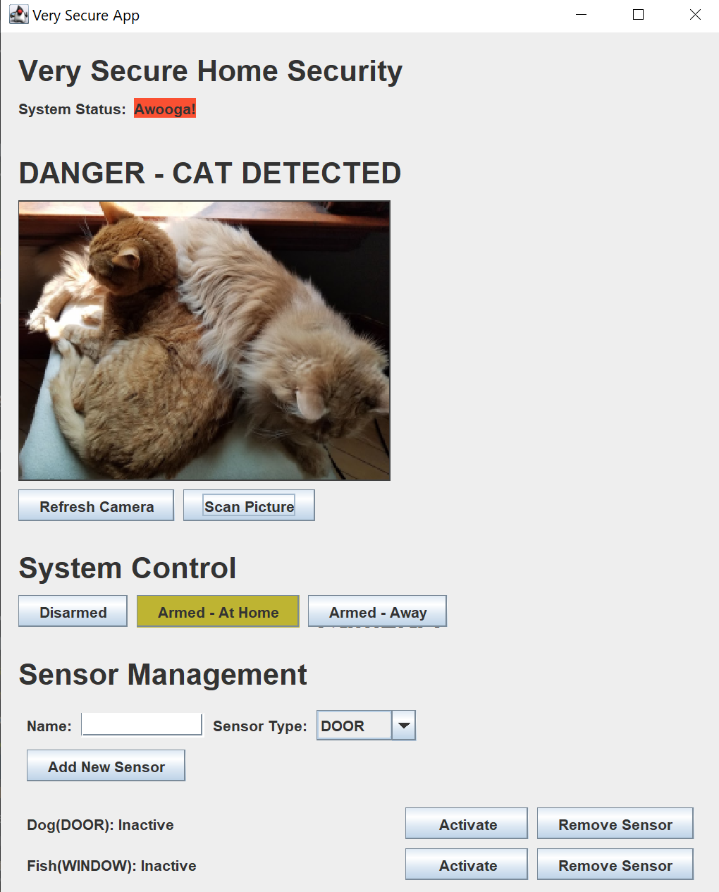

# Watch Out! It's a Cat 🙀 - Detect Your Cat At Home

## "Watch Out! It's a Cat" is an amazing home security application which helps you find your cats at home. When you go out or travel, you can always check your cat without anxiously worrying ヾ(•ω•`)o

## 🐾 Product Features --- Detect your cat at home!
As a home security application, "Watch Out! It's a Cat" provides three main features:
* **(1) Track the status of sensors**
* **(2) Monitor camera input**
* **(3) Change the alarm state of the system by: at home, away or disarm.**

## 🐾 Technical Highlights --- We have better performance!
In order to improve our functions and have a better performance, this application has following 4 technical strengths:
* **(1) Use Maven(a mature software management tool) to streamline the build process and automate our tests and code analysis.**
* **(2) multiple unit-testable modules. Our unit tests covers all the main requirements for better stability and safety during execution.**
* **(3) Independent Image Service System with AWS Image Recognition Library. This connection really improves the effectiveness of the recognition.**
* **(4) A simple but powerful interactive UI interface. Don't worry about how to use it! We make it simple enough to use!**
  

> As a developer, I'm also a cat parent as you do. This app does provide me convenience, so I don't need to bother my friends to check my cat often when I leave. Hope you enjoy it as well ♥♥♥

 
### Author
Tong Guan and the starter code provider - Udacity.
Here is the homepage of Tong Guan: https://yuanyuanbingzi.github.io/en/.

### Acknowledgements

The starter code of this project is provided by Udacity Java NanoProgram final project.
Here is the link: https://github.com/udacity/cd0384-java-application-deployment-projectstarter

